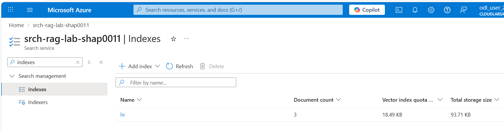
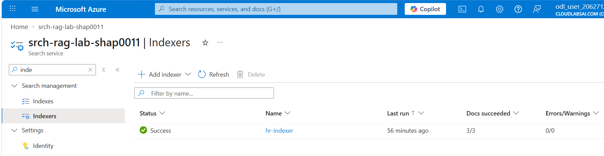
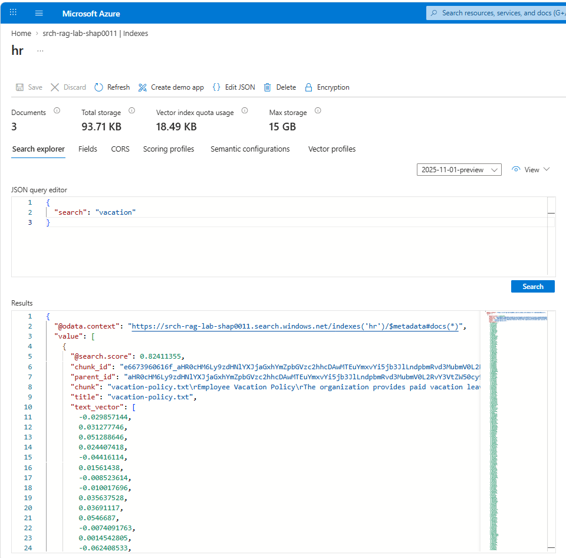
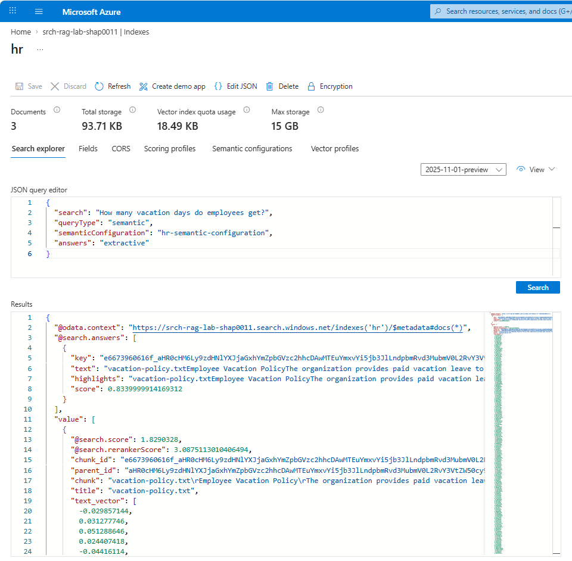
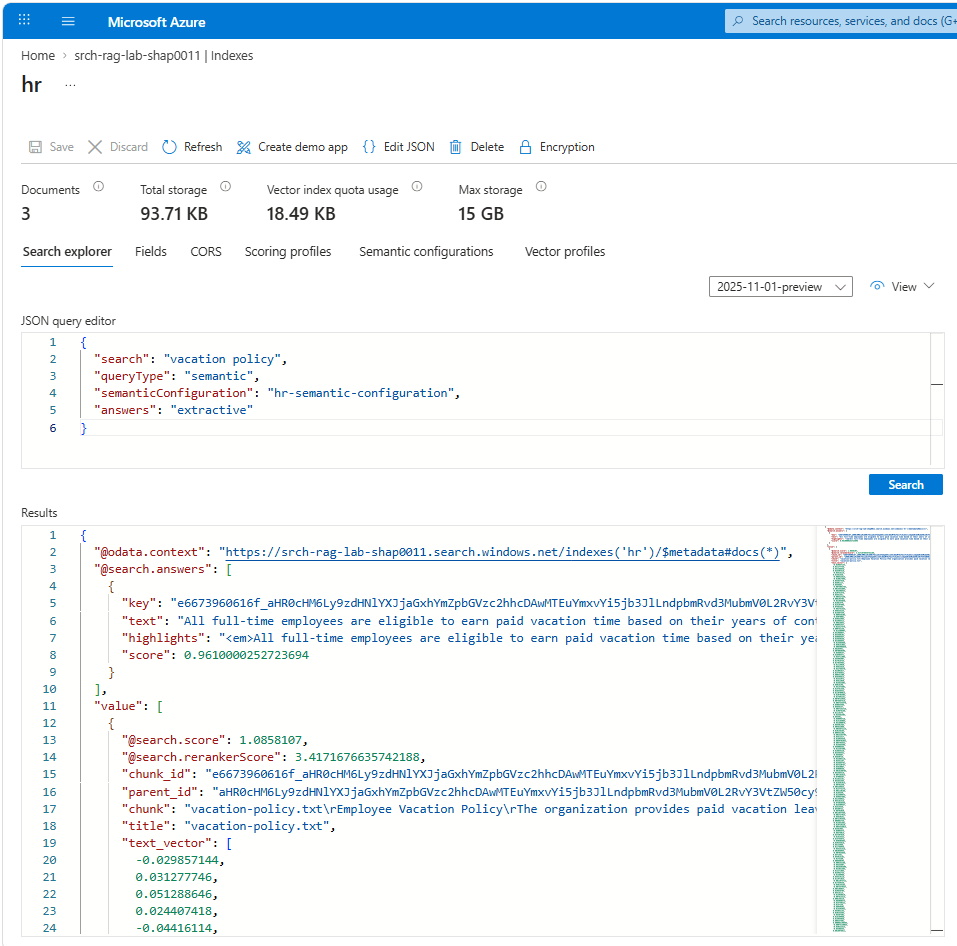

# CST8921 – Cloud Industry Trends

## Lab 11 – Set Up Azure AI Search Index and Deploy Embedding & LLM Models

**St: Olga Durham**

**St#: 040687883**

---

### Step 1 - Create the Azure resources

- Resource Group: `rg-ai-search-lab`, `Canada Central`
- Azure AI Search service: `srch-rag-lab-shap0011`, `Basic`
- Azure OpenAI resource: `aoai-rag-lab-shap0011`
- Storage Account: `stsearchlabfilesshap0011`, blob container `documents`

- Search service name: `srch-rag-lab-shap0011`
- Search endpoint: `https://srch-rag-lab-shap0011.search.windows.net`
- Search admin key: `[SearchAdminKey](/keys.txt)`
- OpenAI endpoint: `https://aoai-rag-lab-shap0011.openai.azure.com/`
- OpenAI key: `[OpenAIKey](/keys.txt)`
- Storage account name: `stsearchlabfilesshap0011`

---

### Step 2 - Deploy the embedding and chat models

- Embedding deployment: `text-embedding-3-small`
- Chat deployment: `gpt-4o`

AZURE_OPENAI_ENDPOINT=https://aoai-rag-lab-shap0011.openai.azure.com/
AZURE_OPENAI_API_KEY=your-key-here
EMBEDDING_MODEL_DEPLOYMENT=text-embedding-3-small
CHAT_MODEL_DEPLOYMENT=gpt-4o

---

### Step 3: Upload HR files to Blob Storage

Storage account: `stsearchlabfilesshap0011`
Container: `documents`

Upload all 3 files from the local repo:

`vacation-policy.txt`
`remote-work-policy.txt`
`benefits-overview.txt`

---

### Step 4: Connect Blob Storage to Azure AI Search

Figure 1: Azure AI Search index successfully populated with HR documents

Figure 2: Successful execution of the indexer pipeline

Figure 3: Keyword-based search results for the query "vacation"

Figure 4: Semantic search with extractive answer for a natural language query

Figure 5: Hybrid search combining keyword, vector, and semantic ranking

Figure 6: Semantic search result answering a natural language question about the remote work policy

---

### Analysis: Keyword vs Semantic vs Hybrid Search

Keyword search returns results based on exact word matching and provides raw document content. Users must manually interpret the results to find relevant information.

Semantic search improves upon keyword search by understanding the intent behind a query. It can return extractive answers directly from the documents, making it easier to retrieve precise information using natural language questions.

Hybrid search combines keyword matching, vector embeddings, and semantic ranking to provide the most relevant and context-aware results. This approach improves both recall and precision, making it the most effective method for information retrieval in this lab.
